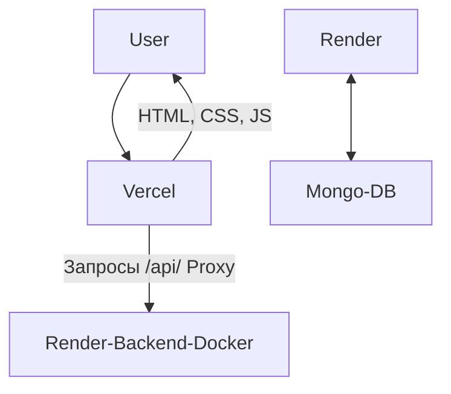

# Трекер Привычек — Учебный Full-Stack проект

Это мой первый полноценный Full-Stack пет-проект, созданный в рамках менторской программы. Главная цель проекта — не просто написать код, а пройти весь жизненный цикл разработки: от идеи и локальной настройки до развертывания рабочего приложения в интернете.

Этот проект демонстрирует понимание того, как фронтенд и бэкенд взаимодействуют друг с другом, а также знание современных практик развертывания и инструментов для поддержания качества кода.

### [Посмотреть Live Demo](https://habit-tracker-lake-mu.vercel.app/)


---

## 🚀 Технологический стек

Проект разделен на две независимые части, каждая из которых использует оптимальные для своей задачи технологии.

#### Frontend
*   **HTML5** и **CSS3**: Семантическая верстка и стилизация.
*   **Vanilla JavaScript (ES6+)**: Вся клиентская логика, работа с DOM и отправка запросов к API с помощью `fetch`.
*   **Деплой**: **Vercel**, с использованием прокси-сервера (`vercel.json`) для безопасного общения с бэкендом.

#### Backend
*   **Node.js** и **Express.js**: Создание RESTful API для управления данными.
*   **MongoDB Atlas**: Облачная NoSQL база данных для хранения информации о привычках.
*   **Mongoose**: Библиотека для удобной работы с MongoDB, определения схем и моделей.
*   **Деплой**: **Render**, с использованием **Docker** для контейнеризации приложения.

#### Инструменты и практики
*   **Docker**: Контейнеризация бэкенд-приложения для консистентности окружения.
*   **Git** и **GitHub**: Контроль версий и хостинг кода.
*   **ESLint** и **Prettier**: Автоматическая проверка качества и форматирование кода.
*   **Conventional Commits**: Ведение читаемой и структурированной истории изменений.

---

## 🏛️ Архитектура развертывания

Приложение развернуто на двух ведущих облачных платформах, каждая из которых решает свою задачу наилучшим образом:



1.  **Пользователь** открывает сайт, размещенный на **Vercel**.
2.  Браузер загружает статические файлы (HTML, CSS, JS).
3.  JavaScript отправляет API-запросы (например, для получения списка привычек) на тот же домен (`/api/...`).
4.  **Vercel** перехватывает эти запросы благодаря правилам в `vercel.json` и незаметно для пользователя перенаправляет их на наш бэкенд, развернутый на **Render**.
5.  **Бэкенд** обрабатывает запрос, общается с базой данных **MongoDB Atlas** и возвращает ответ.
6.  Vercel передает ответ от бэкенда обратно на фронтенд.

---

## 📋 Функционал

*   **Добавление** новой привычки.
*   **Отображение** списка всех добавленных привычек.
*   **Удаление** любой привычки из списка.
*   Все изменения мгновенно сохраняются в базе данных и обновляются в интерфейсе.

---

## 🛠️ Запуск проекта локально

Чтобы запустить проект на своем компьютере, выполните следующие шаги:

1.  **Клонируйте репозиторий:**
    ```bash
    git clone https://github.com/cookiesbro/habit-tracker.git
    cd habit-tracker
    ```

2.  **Настройте бэкенд:**
    *   Перейдите в папку `backend`: `cd backend`
    *   Установите зависимости: `npm install`
    *   Создайте файл `.env` в папке `backend` и добавьте в него переменную окружения с вашей строкой подключения к MongoDB:
        ```
        MONGO_URI=mongodb+srv://...
        ```
    *   Запустите сервер: `npm start` (или `node index.js`)
    *   Сервер будет доступен по адресу `http://localhost:3000`.

3.  **Настройте фронтенд:**
    *   Откройте файл `frontend/script.js`.
    *   **Важно:** для локальной разработки измените `API_BASE_URL` на адрес вашего локального сервера:
        ```javascript
        const API_BASE_URL = 'http://localhost:3000/api/habits';
        ```
    *   Откройте файл `frontend/index.html` в вашем браузере.

Теперь приложение должно работать локально!

---

## ✨ Ключевые выводы и приобретенные навыки

В ходе работы над этим проектом я на практике освоил:
*   Полный цикл разработки Full-Stack приложения.
*   Создание REST API на Node.js/Express и его интеграцию с клиентской частью.
*   Работу с NoSQL базой данных (MongoDB) через Mongoose.
*   **Контейнеризацию** приложений с помощью Docker.
*   **Современные подходы к деплою**: раздельное развертывание бэкенда (Render) и фронтенда (Vercel).
*   Настройку **прокси-сервера** на Vercel для решения проблем с CORS и сокрытия URL бэкенда.
*   Важность использования профессиональных инструментов для поддержания качества кода (ESLint, Prettier).
